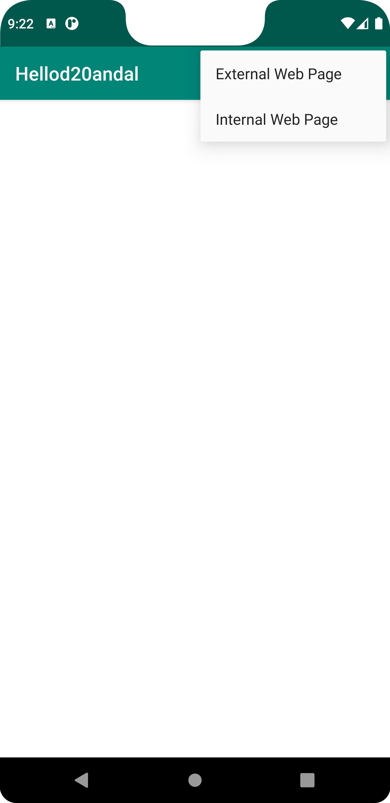
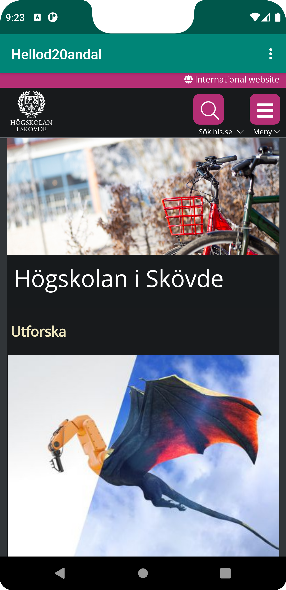
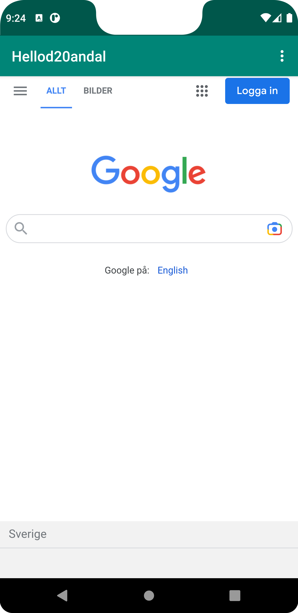

# Rapport

La till uses-premission för internet i Androidmanifest.xml.
I activity_main.xml ändrade jag textview till webview och la till ett id my_webview".
Gjorde en privat variabel i MainActivity.java som heter myWebView.
Lokaliserade webview genom id "my_webview".
Gjorde en webviewcliet och kopplade den till mywebview.
Aktivera Javascript.
Gjorde en html fil i assets filen.
Gjorde en länk till google.se i den (img_2.png).
La till en extern webbsida "www.his.se" (img_1.png).
Skapade en ny xml fil i res_menu för att kunna göra menu dropdown.
Gjorde en onCreateOptionsMenu för att få tillgång till menyn. (img.png)
Hämtar webbsidorna med onOptionsItemSelected genom id menu_external och menu_internal.


## Följande grundsyn gäller dugga-svar:


```

<uses-permission android:name="android.permission.INTERNET" />
----------------------------------------------------------------------

<WebView
    android:id="@+id/my_webview"
    android:layout_width="match_parent"
    android:layout_height="700dp"
    app:layout_constraintBottom_toBottomOf="parent"
    app:layout_constraintEnd_toEndOf="parent"
    app:layout_constraintStart_toStartOf="parent"
    app:layout_constraintTop_toBottomOf="@+id/appBarLayout" >

</WebView>

-----------------------------------------------------------------------
public class MainActivity extends AppCompatActivity {

    private WebView myWebView;
    
    @Override
    protected void onCreate(Bundle savedInstanceState) {
        super.onCreate(savedInstanceState);
        setContentView(R.layout.activity_main);

        Toolbar toolbar = findViewById(R.id.toolbar);
        setSupportActionBar(toolbar);

        myWebView = findViewById(R.id.my_webview);
        myWebView.setWebViewClient(new WebViewClient());

        myWebView.getSettings().setJavaScriptEnabled(true);
    }
    private void showExternalWebPage() {

        myWebView.loadUrl("https://www.his.se");
    }
    private void showInternalWebPage() {

        myWebView.loadUrl("file:///android_asset/html");
    }
    @Override
    public boolean onCreateOptionsMenu(Menu menu) {
        getMenuInflater().inflate(R.menu.main_menu, menu);
        return true;
    }
    @Override
    public boolean onOptionsItemSelected(MenuItem item) {
        switch (item.getItemId()) {
            case R.id.menu_external:
                showExternalWebPage();
                return true;
            case R.id.menu_internal:
                showInternalWebPage();
                return true;
            default:
                return super.onOptionsItemSelected(item);
        }
    }
}

--------------------------------------------------------------------

<?xml version="1.0" encoding="utf-8"?>
<menu xmlns:android="http://schemas.android.com/apk/res/android">
    <item
        android:id="@+id/menu_external"
        android:title="External Web Page" />
    <item
        android:id="@+id/menu_internal"
        android:title="Internal Web Page" />
</menu>


```

Bilder läggs i samma mapp som markdown-filen.


]

